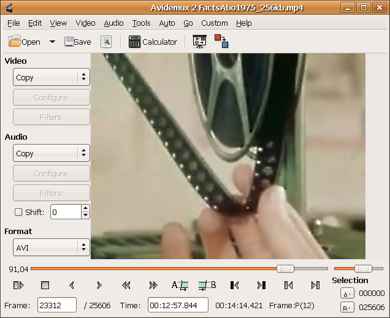

# ICT in Education

### Jaén, November 2016

### English Matters

## Open Source Tools for Teaching and Learning in Class

### José Antonio Vacas @javacasm

# Video editing Tools

### [Avidemux](http://fixounet.free.fr/avidemux/)

* Filters
* Cut & Paste
* Convert between formats

## Where to get help? [forum](http://avidemux.org/smif/index.php)
